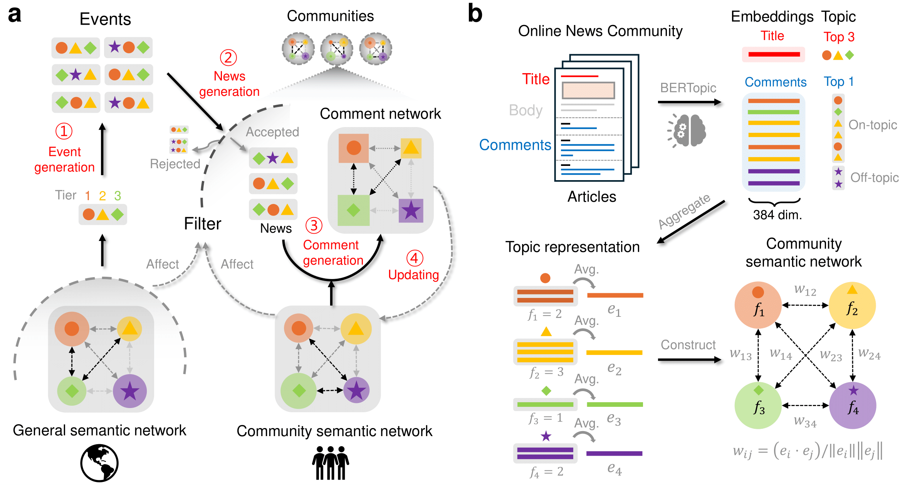

# Dynamics of collective mind in online news communities



## Description
This is a repository for the code used in "Dynamics of collective mind in online news communities" (Ha, 2025).
> Collective discourse and behaviors are shaped by the semantic representations of knowledge and beliefs shared by community members. This collective mind is susceptible to a variety of influences, from editorial practices (alignment, amplification, and reframing of news) to community dynamics (turnover, trolls, and counterspeech). It is critical that communities understand the effects of these influences so that they can protect themselves against manipulation and promote constructive discourse and behaviors. However, this understanding has been limited by the inability to conduct counterfactual experiments in the real world and by the inherent difficulty of predicting complex social systems. Here, we develop a computational model of collective minds, calibrated with data from 400 million comments posted on five online news platforms. The model provides a quantitative understanding of the way collective minds evolve in the context of continuously incoming news about outside events. It enables experimentation with different editorial and community influences, providing insights into the magnitude and persistence of their effects. Our results inform communities about the ways their collective mind can be influenced and what they can do to promote and sustain favorable collective dynamics.

## Installation
```sh
# Clone the repository
git clone https://github.com/nokpil/collmind.git

# Navigate into the project directory
cd collmind

# Install dependencies (if applicable)
pip install -r requirements.txt
```

## Usage
```sh
# Example usage command
python main.py  # or npm start
```

## Contributing
If you'd like to contribute, please fork the repository and use a feature branch. Pull requests are welcome.

## License
This project is licensed under the MIT License - see the [LICENSE](LICENSE.txt) file for details.

## Contact
For any inquiries, please contact seungwoong.ha@santafe.edu or create an issue.
